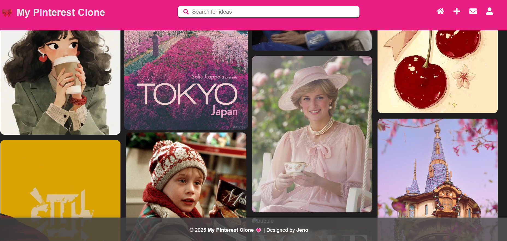

# 🎀 Mini Pinterest Clone

A full-stack Pinterest-style web application where users can upload images (“pins”), add descriptions, create boards, and browse pins in a responsive grid layout.  
This project showcases frontend UI design, backend API creation, image upload handling, and MySQL database integration.

---

## 🚀 Features

- Upload pins with **title + description + image**
- Display all pins in a **Pinterest-style masonry grid**
- Create & manage **boards**
- Responsive UI using **React.js**
- Backend REST API using **Node.js + Express**
- Image uploads using **Multer**
- MySQL database connectivity

---

## 📁 Project Structure

```
mini-pinterest/
│
├── backend/
│   ├── server.js
│   ├── db.js
│   ├── .env
│   ├── uploads/
│   └── package.json
│
└── frontend/
    ├── src/
    │   ├── App.js
    │   ├── index.js
    │   └── components/
    │       └── PinCard.js
    ├── public/
    └── package.json
```

---

## ⚙️ Installation & Setup

### **1️⃣ Clone the Repository**
```bash
git clone https://github.com/your-username/mini-pinterest.git
cd mini-pinterest
```

---

# 🖥️ Backend Setup

### **2️⃣ Install Dependencies**
```bash
cd backend
npm install
```

### **3️⃣ Create a `.env` file**
```
DB_HOST=localhost
DB_USER=root
DB_PASSWORD=yourpassword
DB_NAME=mini_pinterest
PORT=5000
```

### **4️⃣ Start Backend**
```bash
node server.js
```

Backend runs at:  
**http://localhost:5000**

---

# 🎨 Frontend Setup

### **5️⃣ Install Dependencies**
```bash
cd ../frontend
npm install
```

### **6️⃣ Start Frontend**
```bash
npm start
```

Frontend runs at:  
**http://localhost:3000**

---

## 🗄️ Database Schema (MySQL)

```sql
CREATE DATABASE mini_pinterest;
USE mini_pinterest;

CREATE TABLE users (
  id INT AUTO_INCREMENT PRIMARY KEY,
  name VARCHAR(100),
  email VARCHAR(100),
  password VARCHAR(255)
);

CREATE TABLE boards (
  id INT AUTO_INCREMENT PRIMARY KEY,
  name VARCHAR(100),
  user_id INT,
  FOREIGN KEY (user_id) REFERENCES users(id)
);

CREATE TABLE pins (
  id INT AUTO_INCREMENT PRIMARY KEY,
  title VARCHAR(255),
  description TEXT,
  image_url VARCHAR(255),
  user_id INT,
  board_id INT,
  created_at DATETIME DEFAULT CURRENT_TIMESTAMP,
  FOREIGN KEY (user_id) REFERENCES users(id),
  FOREIGN KEY (board_id) REFERENCES boards(id)
);
```

---

## 📥 Sample Test Data (Optional)

```sql
INSERT INTO users (name, email, password) VALUES
('Alice', 'alice@example.com', 'alice123'),
('Bob', 'bob@example.com', 'bob123');

INSERT INTO boards (name, user_id) VALUES
('Travel', 1),
('Food', 1),
('Tech', 2);

INSERT INTO pins (title, description, image_url, user_id, board_id) VALUES
('Beautiful Beach', 'Sunny beach in Maldives', 'https://picsum.photos/300/200?random=1', 1, 1),
('Mountain Hike', 'Hiking in Alps', 'https://picsum.photos/300/200?random=2', 1, 1),
('Delicious Pizza', 'Cheesy pizza slice', 'https://picsum.photos/300/200?random=3', 1, 2),
('Smartphone Review', 'Latest smartphone review', 'https://picsum.photos/300/200?random=4', 2, 3),
('Tech Conference', 'Annual tech meetup', 'https://picsum.photos/300/200?random=5', 2, 3);
```

---

## 🔮 Future Enhancements

- JWT-based authentication  
- Like / Save pins  
- Drag-and-drop UI  
- Cloud image storage (Cloudinary / AWS S3)  
- React Router pages (Boards, Profile)

---

## 👤 Author

Jenolin N 
Web Developer | Frontend Developer  
GitHub: https://github.com/jenojane

---

## 📸 Screenshot

